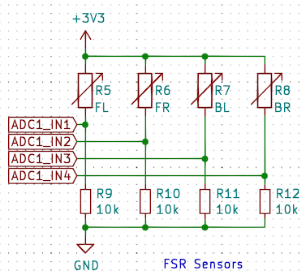

# Registers

### Abbreviations

In the following sections we will use the following abbreviations:

- **LPF** = low pass filter
- **FSR** = force sensitive resistor, the technology used to digitize pressure information
- **FL** = front left, referring tot the FSR located on the front and left side of the sole as seen from above
- **FR** = front right, referring tot the FSR located on the front and right side of the sole as seen from above
- **BL** = back left, referring tot the FSR located on the back and left side of the sole as seen from above
- **BR** = back right, referring tot the FSR located on the back and right side of the sole as seen from above

## Registers table

SPR2010 uses the following registers:

Address | Size (Bytes) | Data Name                                  | Memory | Access |Initial Value | Range | Unit
:------:|:------------:|--------------------------------------------|:------:|:------:|-------:|:---------:|------|
0       | 2            | Model Number                               | EEPROM | R      |0x5301  | -         | -
6       | 1            | Firmware Version                           | EEPROM | R      | 0x02   | -         | -
7       | 1            | ID                                         | EEPROM | RW     | 100    | 0 ~ 252   | -
8       | 1            | [Baud Rate](#baud-rate)                    | EEPROM | RW     | 3      | 0 ~ 7     | -
9       | 1            | [Protocol Version](#protocol-version)      | EEPROM | RW     | 2      | 1 ~ 2     | -
13      | 1            | Return Delay Time (*not implemented at the moment*) | EEPROM | RW     | 0      | 0 ~ 254   | -
14      | 1            | [Low pass filter scaler](#low-pass-filter-scalers) for FSR| EEPROM | RW     | 15     | 1 ~ 255   | -
15      | 1            | [Low pass filter scaler](#low-pass-filter-scalers) for Voltage/Current| EEPROM | RW     | 30     | 1 ~ 255   | -
20      | 2            | [Calibration](#calibration) multiplier FL  | EEPROM | RW     | 1      | 1 ~ 255   | -
22      | 2            | [Calibration](#calibration) divisor FL     | EEPROM | RW     | 1      | 1 ~ 255   | -
24      | 2            | [Calibration](#calibration) multiplier FR  | EEPROM | RW     | 1      | 1 ~ 255   | -
26      | 2            | [Calibration](#calibration) divisor FR     | EEPROM | RW     | 1      | 1 ~ 255   | -
28      | 2            | [Calibration](#calibration) multiplier BL  | EEPROM | RW     | 1      | 1 ~ 255   | -
30      | 2            | [Calibration](#calibration) divisor BL     | EEPROM | RW     | 1      | 1 ~ 255   | -
32      | 2            | [Calibration](#calibration) multiplier BR  | EEPROM | RW     | 1      | 1 ~ 255   | -
34      | 2            | [Calibration](#calibration) divisor BR     | EEPROM | RW     | 1      | 1 ~ 255   | -
64      | 1            | Enable device                              | RAM    | RW     | 1      | 0 ~ 1     | -
70      | 2            | [Raw reading](#raw-readings) FL            | RAM    | R      | -      | 0 ~ 2047  | 3.3V * reading / 2047
72      | 2            | [Raw reading](#raw-readings) FR            | RAM    | R      | -      | 0 ~ 2047  | 3.3V * reading / 2047
74      | 2            | [Raw reading](#raw-readings) BL            | RAM    | R      | -      | 0 ~ 2047  | 3.3V * reading / 2047
76      | 2            | [Raw reading](#raw-readings) BR            | RAM    | R      | -      | 0 ~ 2047  | 3.3V * reading / 2047
78      | 2            | [Raw reading](#raw-readings) FL            | RAM    | R      | -      | 0 ~ 2047  | 3.3V * reading / 2047
80      | 2            | [Raw reading](#raw-readings) FR            | RAM    | R      | -      | 0 ~ 2047  | 3.3V * reading / 2047
82      | 2            | [Raw reading](#raw-readings) BL            | RAM    | R      | -      | 0 ~ 2047  | 3.3V * reading / 2047
84      | 2            | [Raw reading](#raw-readings) BR            | RAM    | R      | -      | 0 ~ 2047  | 3.3V * reading / 2047
85      | 1            | [Voltage](#voltage-and-current)            | RAM    | R      | -      | 0 ~ 255   | in units of 0.1V
86      | 1            | [Current](#voltage-and-current)            | RAM    | R      | -      | 0 ~ 255   | in units of 0.01A
87      | 1            | LPF Voltage                                | RAM    | R      | -      | 0 ~ 255   | in units of 0.1V
88      | 1            | LPF Current                                | RAM    | R      | -      | 0 ~ 255   | in units of 0.01A
98      | 2            | Loop rate                                  | RAM    | R      | -      | 0 ~ 65535 | in Hz
100     | 2            | Calibrated reading FL                      | RAM    | R      | -      | 0 ~ 2047  | 3.3V * reading / 2047
102     | 2            | Calibrated reading FR                      | RAM    | R      | -      | 0 ~ 2047  | 3.3V * reading / 2047
104     | 2            | Calibrated reading BL                      | RAM    | R      | -      | 0 ~ 2047  | 3.3V * reading / 2047
106     | 2            | Calibrated reading BR                      | RAM    | R      | -      | 0 ~ 2047  | 3.3V * reading / 2047

## Registers details

### Baud rate

Baud rate is handled as newer Dynamixel devices. The register contains a code that maps to actual baud rates as follows:

Value       | Baud Rate     | Margin of Error
------------|---------------|----------------
7           | 4.5M [bps]    | 0.000 [%]
6           | 4M [bps]      | 0.000 [%]
5           | 3M [bps]      | 0.000 [%]
4           | 2M [bps]      | 0.000 [%]
3 (Default) | 1M [bps]      | 0.000 [%]
2           | 115,200 [bps] | 0.000 [%]
1           |57,600 [bps]   | 0.000 [%]
0           | 9,600 [bps]   | 0.000 [%]

### Protocol version

SPR2010 supports both [Protocol 1](https://emanual.robotis.com/docs/en/dxl/protocol1/) and [Protocol 2](https://emanual.robotis.com/docs/en/dxl/protocol2/) Dynamixel communications.

### Low pass filter scalers

When reading analog signals with an ADC they will contain significant noise. One simple option to smoothen these readings is to subject them to a **low pass filter** (LPF). The common approach to implement such a filter is the following:

x_n)

Where:
- ,  are the values of the smoothed measure at times *n* and *n+1*
-  is the raw value added every new iteration to the smoothed measure
-  is the LPF factor and should be a number between 0 and 1 with a value towards 0 giving more emphasis to older samples (smoother) and a value towards 1 giving more importance to the new values (thus more reactive but also subject to more noise)

In order to avoid ``float`` multiplications in the STM32F103 micro-controller (that are very expensive from a time perspective) we use a slightly modified version of the formula above that can use only integer calculations:

Where *k* is an integer factor that can be viewed such that *k+1* an inverse of .

### Raw readings

The readings for the FSRs as well as the ones for voltage and current are performed using the STM32F103 ADC convertors that offer 12 bits sampling and are measured against the reference 3.3V voltage that powers the chip.

In the case of FSR readings the circuit that is used is the following:

Therefore the voltage that is converted by the micro-controllers ADCs is:

Where  is the miro-chip reference voltage for ADC conversions, in this case 3.3V and  is the FSR's resistance that varies with the pressure applied while *R* is the value of the resistor that is provided in series with the FSR . The FSR provides a relatively linear relation between the the pressure and *conductance* (which is 1/resistance) and it would be better to express the equation in this way. By extracting  from the above equation and then inverting it we obtain the conductance of the FSR for a given read voltage *V*:

})

Because the voltages are produced by the ADC as a 12 bit number representing the relative voltage to  we can replace them with their "digital" representation: the [V_{REF}](https://latex.codecogs.com/svg.latex?V_{REF}) becomes 4095 (the largest 12 bit numbers) and V will be replaced with *A* as in the 12bit representation of the actual voltage *V*. We can therefore write the previous equation as:

})

We can now define a measure (we'll call it ) that will eliminate all the constants (the correlation between the pressure and the conductance, the resistance *R*) and keep only a measure like this:

This is a very simple measure to calculate and has the advantage that is objectively tracking the same trajectory as the conductance *S* of the FSR. If the ADC reading *A* is 0 then the *raw* value will be 0. If the reading is 4095 (saturated input) we will have a division by 0 so we will consider that the *raw* value 4095. If the value is 4094 then the *raw* becomes 4094. But what is interesting is that the shape of this translation is not linear due to the (4095-A) denominator.

This *raw* value is what we provide in the registers 72-76 and this should only be used in a comparative manner (relative to the other FSRs) to determine a relative position of the resultant forces across all 4 sensors. To accommodate the differences between sensors we provide registers for [calibrating](#calibration) the raw readings so that combining the values are more accurate.

### Voltage and current

The readings for voltage and current include conversions that are dependent on the other passive components in the design and are reported in the registers as stated, with the units of measures indicated in the last column. For instance a reading of 123 in the Voltage register (85) means the battery exhibits 12.3V. A reading of 152 in the current register (86) means the current flow *from the battery connected to that foot* is 1.52A.

### Calibration

The FSRs produce noisy values and there are significant differences between the readings produced by two different sensors. To adjust these values, the SPR2010 includes the possibility of applying a correction factor to the reading and to expose this calibrated reading. Similar to the [low pass filters](#low-pass-filter-scalers), in order to avoid ``float`` calculations we employ two ``unsigned int`` factors: a **multiplier (m)** and a **divisor (d)**. The calibrated value provided by the sensor will be:

The two factors *m* and *d* are by default 1 and the user can employ a calibration routine (dependent on how the sensors are integrated) and adjust these values so that the readings produced by the 4 sensors are comparable and can be combined in a more accurate way to produce information about the position resultant pressure across the sole.